<div align="center">
  
</div>

<br/>

<table width="100%" border="0" cellspacing="0" cellpadding="0">
<tr>
<td width="58%" valign="top">

```
比起功能的无脑堆砌，我更在意把项目打造成
线上可跑、可观测、可迭代的工程化作品。
```

后端开发 · 系统设计 · DevOps 工程化体系。<br/>
关注高并发下的缓存策略、消息队列解耦、CI/CD 容器化交付。<br/>
正从「优秀开发者」进化为「全局视角系统架构师」。

<br/>

[](mailto:moyuan@oai-o.com)
&nbsp;


</td>
<td width="4%"></td>
<td width="38%" valign="top">

```yaml
lang:    Java 17
fw:      Spring Boot · Spring Cloud
cache:   Redis · 多级缓存 · 分布式锁
mq:      RabbitMQ · SSE
db:      MySQL · MongoDB
ops:     Docker · Nginx · CI/CD
web:     Vue 3 · TypeScript
```

</td>
</tr>
</table>

---

<br/>

**PROJECTS**

<table width="100%" border="0">
<tr>
<td width="50%" valign="top">

**Rent House**&emsp;`Spring Boot · Vue 3 · Docker`

房屋租赁全栈工程化实践。Redis 多级缓存降低热点压力，RabbitMQ 解耦核心业务流，Docker Compose 一键容器化交付。高可用设计，完整 CI/CD 闭环。

</td>
<td width="4%"></td>
<td width="46%" valign="top">

**Foodie Platform**&emsp;`LBS · Redis · 高并发`

LBS 场景下的高频访问重构。攻克复杂列表分页与多级缓存一致性难题，Redis 协同设计支撑峰值写入。

</td>
</tr>
<tr><td colspan="3"><br/></td></tr>
<tr>
<td colspan="3" valign="top">

**MoGPT**&emsp;`LLM · SSE · Spring AI`

接入 LLM 的沉浸式 AI 交互应用。服务端 SSE 流式推送实现类 ChatGPT 丝滑输出，完整会话上下文管理，支持多轮深度对话。

</td>
</tr>
</table>

<br/>

---

<br/>

<div align="center">

&nbsp;&nbsp;

</div>

<br/>

<div align="center">
  
</div>

<br/>

---

<div align="center">
<sub><code>// 系统的价值，不在于它能做什么，而在于它挂掉时你多快能让它重新跑起来。</code></sub>
</div>
