  

<h2 align="center">MOYUAN</h2>

<code>Backend Engineer · System Design · DevOps</code>

  
  

---

<table width="100%">
  <tr>
    <td width="58%" valign="top">

### ✦ ABOUT

> 系统像夜行的列车：  
> 速度只是表象，  
> 回到轨道才是本事。

后端开发 · 系统设计 · DevOps 工程化 
缓存策略 / 异步解耦 / 性能优化 / CI/CD

</td>
<td width="42%" valign="top">

### 🛠 TECH STACK

**Backend**
 

**Data**
 

**Messaging**
 

**DevOps**
 

**Frontend**
 

**Tooling**
 

</td>
  </tr>
</table>

---

  
  

  

<code>// ship it, observe it, iterate.</code>

